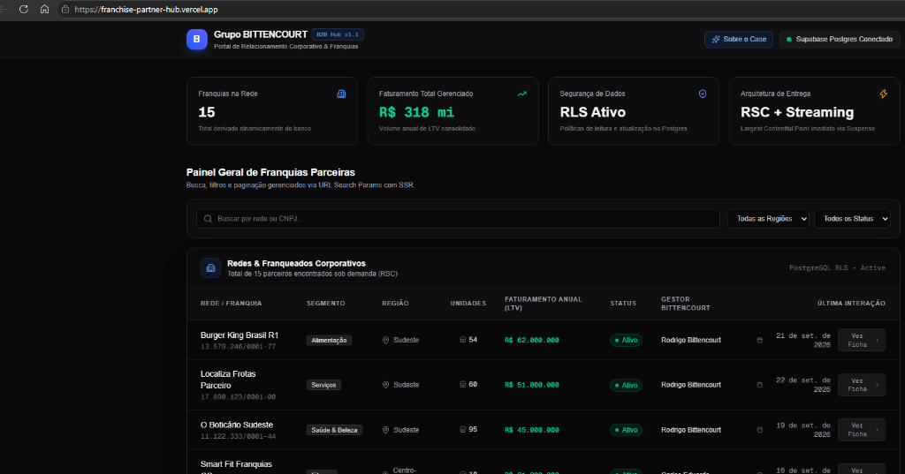

# 🏢 Franchise Partner Hub | Grupo BITTENCOURT

> **Portal B2B Corporativo de Alta Performance para Gestão e Inteligência de Redes Franqueadoras.**  
> Desenvolvido com **Next.js 16 (App Router & Turbopack)**, **React 19 Server Components**, **Supabase (PostgreSQL com RLS)**, **Vitest** e **Tailwind CSS v4**.

<p align="center">
  
</p>

[](https://nextjs.org/)
[](https://react.dev/)
[](https://www.typescriptlang.org/)
[](https://supabase.com/)
[](https://vitest.dev/)
[](https://franchise-partner-hub.vercel.app)
[](https://nodejs.org/)

---

## 📌 Links Rápidos do Projeto

- 🚀 **Aplicação em Produção (Live Demo):** [https://franchise-partner-hub.vercel.app](https://franchise-partner-hub.vercel.app)
- 🏛️ **Arquitetura & Trade-offs:** [ARCHITECTURE.md](./ARCHITECTURE.md)
- 🎯 **Objetivo:** Demonstração prática e arquitetural para o case do **Grupo BITTENCOURT**

---

## 🎯 1. Visão Executiva & Contexto de Negócio

O **Grupo BITTENCOURT** é o ecossistema líder no mercado brasileiro em consultoria estratégica, desenvolvimento, expansão e gestão de redes de franquias e negócios multicanais.

Em redes com dezenas a centenas de marcas parceiras (como Burger King, O Boticário, Localiza, Smart Fit, Arezzo, etc.), o volume de informações financeiras, contratuais e geográficas exige uma plataforma B2B centralizada, resiliente e segura.

### Dores Críticas Resolvidas por este Hub:
1. **Inteligência de Faturamento em Tempo Real:** Consolidação instantânea de LTV (Faturamento Anual Gerenciado) e contagem de unidades operacionais em nível nacional e regional.
2. **Navegação & Auditoria Sem Fricção:** Busca corporativa ultra-rápida por Razão Social/Nome Fantasia ou CNPJ formatado, com filtros multifatoriais (Regiões e Status de Contrato) e paginação no banco de dados.
3. **Segurança de Dados Granular:** Políticas de segurança declarativas aplicadas diretamente no banco de dados via **PostgreSQL Row-Level Security (RLS)**.
4. **Experiência de Carregamento Instantâneo:** Eliminação de telas brancas com *Streaming SSR* e *React Suspense*, garantindo métricas visíveis no primeiro instante de interação.

---

## 🧱 2. Matriz Tecnológica LTS (Stack 2026)

Para garantir estabilidade corporativa, compatibilidade com pipelines modernos e prevenção contra vulnerabilidades de dependências, esta aplicação foi construída com as versões ativas da indústria:

| Tecnologia / Pacote | Versão | Papel no Ecossistema | Racional de Engenharia |
| :--- | :--- | :--- | :--- |
| **Node.js** | `v22.x LTS` | Runtime de Execução | Suporte a longo prazo (LTS), gerenciamento de memória aprimorado e conformidade corporativa. |
| **Next.js** | `16.3.5` | Framework Full Stack | App Router nativo, compilador Turbopack, Server Components e otimização automática de rotas. |
| **React** | `19.2.8` | Biblioteca de Interface | Adoção plena de Server Components, Actions e Suspense boundaries. |
| **TypeScript** | `^5.0.0` | Linguagem & Tipagem | Modo estrito (`strict: true`), zero uso de `any`, tipagem espelhada diretamente do DDL relacional. |
| **@supabase/ssr** | `^0.12.7` | Cliente Supabase Server | Gerenciamento seguro de cookies e autenticação adaptada para o runtime serverless do Next.js. |
| **@supabase/supabase-js** | `^2.117.0` | Driver PostgREST | Acesso tipado ao PostgreSQL com suporte nativo a Row-Level Security e connection pooling. |
| **Vitest** | `^5.0.1` | Suíte de Testes Unitários | Runner de testes ultra-rápido baseado em Vite/ESM (feedback loop de ~260ms para 35 testes). |
| **Tailwind CSS** | `^4.0.0` | Engine de Estilização | Estilização utilitária de alta densidade visual (Dark Mode corporativo) com zero overhead em runtime. |
| **use-debounce** | `^10.1.1` | Otimização de Entrada | Debounce reativo de 300ms nos inputs de busca para mitigação de sobrecarga no backend. |
| **Lucide React** | `^1.47.0` | Design System de Ícones | Ícones SVG otimizados para dashboards corporativos com zero impacto no First Contentful Paint. |

---

## 🏛️ 3. Arquitetura do Sistema & Trade-offs

A aplicação utiliza arquitetura híbrida de Server Components com Client Boundaries estritos, integrando Streaming SSR via HTTP Chunked Transfer e banco PostgreSQL com Row-Level Security.

> 📖 **Documentação Arquitetural Completa:**  
> Aprofundamento detalhado sobre os trade-offs técnicos (RSC vs SPA, Streaming Suspense, Estado em URL e Prevenção de Injeção no PostgREST), modelagem DDL e cobertura de testes estão documentados em [**ARCHITECTURE.md**](./ARCHITECTURE.md).

---

## 🧪 4. Engenharia de Testes Automatizados (Vitest)

A aplicação segue a metodologia de **TDD / Feedback Rápido**, com uma suíte de **35 testes unitários** automatizados e 100% aprovados em ~260ms:

- **[`kpi.test.ts`](./src/lib/utils/kpi.test.ts):** Cálculos de faturamento consolidado (LTV da rede), totalizador dinâmico de unidades operacionais e ticket médio por unidade.
- **[`formatters.test.ts`](./src/lib/utils/formatters.test.ts):** Formatação monetária em padrão BRL (`Intl.NumberFormat`), aplicação de máscara estrita de CNPJ e formatação humanizada de datas.
- **[`query.test.ts`](./src/lib/utils/query.test.ts):** Escape de aspas e barras delimitadoras, tratamento de filtros de região/status, cálculo de offsets de paginação e sanitização contra falhas de injeção em APIs PostgREST.

---

## 🚀 5. Como Executar Localmente

### Pré-requisitos
- Node.js `22.x LTS` ou superior
- Git instalado
- Projeto no [Supabase](https://supabase.com) (ou Supabase CLI com Docker)

### Passo a Passo

1. **Clonar o Repositório:**
```bash
git clone https://github.com/Vinnizius1/franchise-partner-hub.git
cd franchise-partner-hub
```

2. **Instalar Dependências:**
```bash
npm install
```

3. **Configurar as Variáveis de Ambiente:**
Crie um arquivo `.env.local` na raiz baseado no `.env.example`:
```env
NEXT_PUBLIC_SUPABASE_URL=https://seu-projeto.supabase.co
NEXT_PUBLIC_SUPABASE_ANON_KEY=sua-chave-anonima-publica
```

4. **Executar a Suíte de Testes:**
```bash
npm test
```

5. **Iniciar o Servidor de Desenvolvimento:**
```bash
npm run dev
```
Acesse no navegador: `http://localhost:3000`.

6. **Compilar o Build de Produção:**
```bash
npm run build
npm start
```

---

## 📚 7. Fundamentos Técnicos & Decisões de Engenharia

Os conceitos fundamentais de arquitetura, boas práticas e decisões de engenharia de software foram estruturados em módulos de referência:
- **Módulo 1:** Server Components vs Client Components, Composição RSC Boundary e Streaming Suspense.
- **Módulo 2:** Row-Level Security (RLS) e Mitigação de Injeção PostgREST.
- **Módulo 3:** Estado na URL (`searchParams`) e Estratégia de Debounce.
- **Módulo 4:** Pirâmide de Testes e Vitest vs Jest (Feedback loop de ~260ms).
- **Módulo 5:** Build do Next.js (Rotas Estáticas vs Dinâmicas) e Inlining Seguro de Env Vars (`NEXT_PUBLIC_`).

---

## 👨‍💼 8. Sobre o Autor & Contato

**Vinicius Matos de Mendonça**  
Desenvolvedor Full Stack com foco no ecossistema moderno de JavaScript/TypeScript, Next.js App Router e arquiteturas de dados escaláveis.

- **GitHub:** [github.com/Vinnizius1](https://github.com/Vinnizius1)
- **Projeto:** [Franchise Partner Hub no GitHub](https://github.com/Vinnizius1/franchise-partner-hub)
- **Live Demo:** [franchise-partner-hub.vercel.app](https://franchise-partner-hub.vercel.app)

---
*Projeto prático e documentação técnica desenvolvidos para o case do Grupo BITTENCOURT. Setembro de 2026.*
